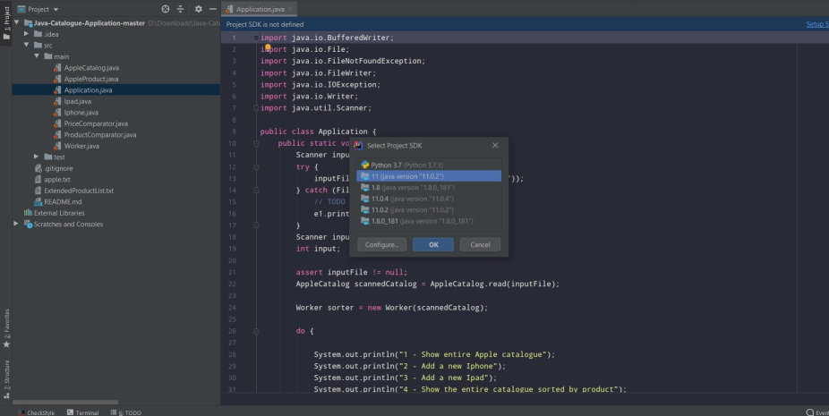
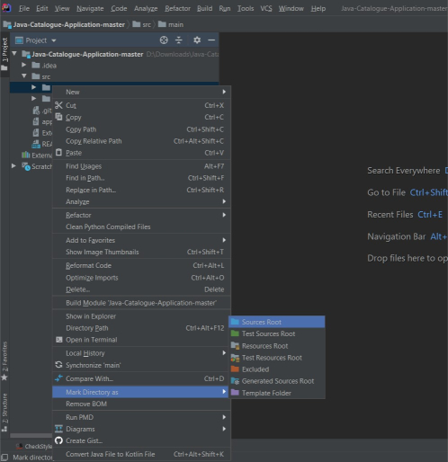
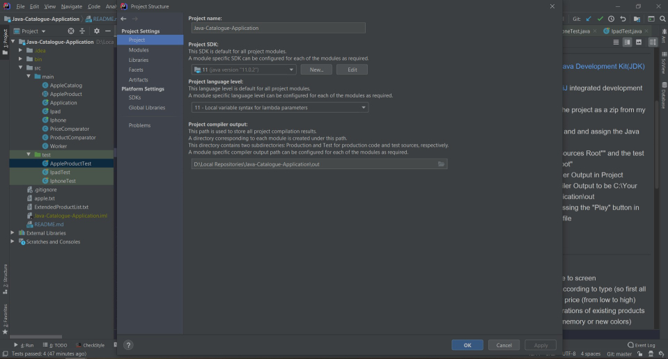

# Java-Catalogue-Application
## About the project
Text based catalogue application written in Java utilizing OOP principles, sorting,
multithreading and basic unit testing with JUnit. This is a practice project I've created after completing
my first OOP course.
## Project Setup with IntelliJ IDE
1. Download and install the [Java Development Kit(JDK)](https://www.oracle.com/technetwork/java/javase/downloads/jdk11-downloads-5066655.html) on your computer.
2. Download and install [IntelliJ](https://www.jetbrains.com/idea/).
3. Clone down or download the project as a zip from my repository.
4. Open the project in IntelliJ and and assign the Java SDK. 
5. Mark the main folder as "Sources Root"" and the test folder as "Test Sources Root".  
6. Go to the file menu in the top left corner, select project structure from the dropdown,
assign the Project Language Level to 11 and the Project Compiler Output to be: Drive:\Your Path\Java-Catalogue-Application\out.   
7. Run the application by pressing the "Play" button in src/main/application.class file.
## Requirements
- Reads in the file apple.txt
- Output the entire catalogue to screen
- Sort the entire catalogue according to type (so first all iPhones, then all iPads)
or price (from low to high)
- Allows to add new configurations of existing products (e.g. with higher
capacity memory or new colors)
- Allows to write to file all product information (preserving the file format!).
- Write an equals() method for each class (except for the class that contains the
main() method)
- To enable user interaction, please provide a command line interface with
System.out.*.

Object attributes:
An iPhone is characterized by:
- A model name
- A screensize
- A processor
- A type of modem, either GSM or CDMA
- A color
- The amount of memory
- The presence of 3D Touch technology
- The price

An iPad is characterized by:
- A model name
- A screensize
- A processor
- The presence of 4G, rather than only wifi
- A color
- The amount of memory
- The price

UI requirements:

Catalogue display requirements:

